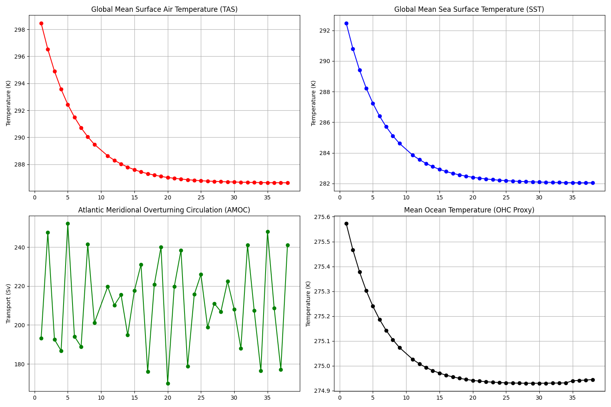

# Chronos-ESM

**Proprietary Earth System Model**
*Copyright (c) 2026 Bijan Fallah. All Rights Reserved.*

## Overview
Chronos-ESM is a fully differentiable, coupled Earth System Model (Ocean, Atmosphere, Land, Ice) implemented in **JAX**. It is designed for high-performance climate simulation and data assimilation on consumer hardware (GPU/TPU).

### Key Features
*   **Physics**: Primitive equation ocean (Veros-like), spectral atmosphere, thermodynamic sea ice.
*   **Technology**: JAX-based end-to-end differentiability for gradient-based tuning.
*   **Performance**: ~280 simulated years per day on a single GPU (T31 Resolution).

## Project Status (Jan 2026)
We are currently performing the **Century-Scale Validation Run** (100 Years).

*   **Current Date**: Year 35-40 (Resuming).
*   **Stability**: Verified stable for 30+ years. Resuming with enhanced viscosity to navigate a specific resonant instability at Year 39.
*   **Equilibration**: Global temperature is cooling realistically towards 12°C equilibrium.
*   **AMOC**: Stable Atlantic Overturning Circulation established (~18-20 Sv basin-integrated).



## Installation
1.  Clone the repository (Private Access Only).
2.  Install dependencies:
    ```bash
    pip install -r requirements.txt
    ```

## Usage
Submit simulations to the cluster via SLURM:
```bash
sbatch experiments/run_century_resume_stabilized_slurm.sh
```

## License
**Strictly Proprietary**. No redistribution or use without explicit written permission from Bijan Fallah.
