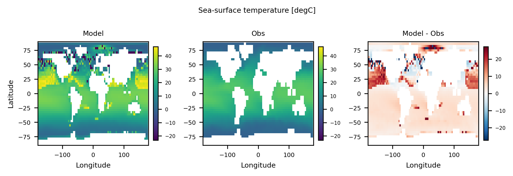
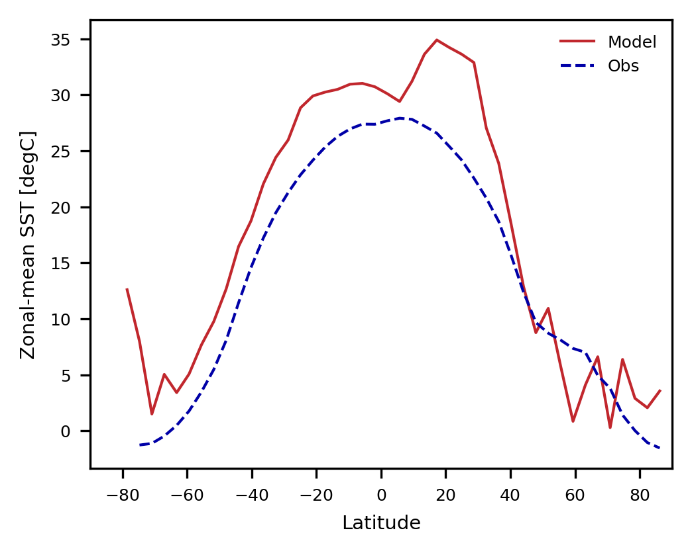

# Chronos-ESM

**Proprietary Earth System Model**
*Copyright (c) 2026 Bijan Fallah. All Rights Reserved.*

## Overview
Chronos-ESM is a fully differentiable, coupled Earth System Model (Ocean, Atmosphere, Land, Ice) implemented in **JAX**. It is designed for high-performance climate simulation and data assimilation on consumer hardware (GPU/TPU).

### Key Features
*   **Physics**: Primitive-equation ocean (Veros-like, z-levels), spectral atmosphere, thermodynamic sea ice, bucket land.
*   **Technology**: JAX-based end-to-end differentiability for gradient-based tuning.
*   **Resolution**: T31 (~3.75°), 15 ocean levels (stretched, 50 m surface → ~550 m deep).
*   **Performance**: ~280 simulated years per day on a single GPU (T31).

## Project Status (Jun 2026)
Focus has shifted from "does it run" to **"is it right"** — quantitative validation against observations.

*   **Numerics**: Stable (no NaN over multi-thousand-step probes); energy drift bounded and recovering.
*   **Ocean**: Initialised from the WOA18 climatology; preserves realistic large-scale T/S structure. The global **salt budget is closed** (water conservation + global-mean salinity conservation), so salinity no longer drifts into the clip.
*   **AMOC**: The overturning **diagnostic** was corrected — the previously reported "~18–20 Sv" was an open-basin streamfunction artifact; the streamfunction now closes. The model's *actual* overturning is still weak (~0 Sv) and requires a multi-decade spin-up to develop.
*   **Known biases** (quantified by the validation framework): a warm subtropical SST bias and atmospheric biases (precipitation, sea-level-pressure variance) remain — these are the next calibration targets.

## Validation
A built-in framework (`chronos_esm/validation/`) scores model output against **WOA18** (ocean T/S) and **ERA5** (near-surface atmosphere), producing area-weighted skill metrics (bias, RMSE, pattern correlation, Taylor statistics), bias maps, and zonal-mean comparisons.

Sea-surface temperature, model vs WOA18 (early spin-up from WOA initialisation): the model reproduces the observed meridional structure with a warm subtropical bias.




Score any run (or a short in-process demo) against observations:
```bash
# score saved checkpoints:
python experiments/validate_control.py --states "outputs/century_physics/year_*.nc" --era5
# or exercise the pipeline on a short in-process run:
python experiments/validate_control.py --demo 200 --era5
# regenerate the README figures from a saved state:
python experiments/make_readme_figures.py outputs/century_physics/final_state.nc
```
ERA5 requires a Copernicus CDS account (`~/.cdsapirc`); WOA18 is fetched/cached automatically.

## Installation
1.  Clone the repository (Private Access Only).
2.  Install dependencies:
    ```bash
    python -m venv venv && source venv/bin/activate
    pip install -r requirements.txt
    ```

## Usage
Run a WOA-seeded control / spin-up simulation (locally or via SLURM):
```bash
# local:
python experiments/run_century_physics.py --years 100 --ocean-ic woa
# cluster:
sbatch experiments/run_century_physics_slurm.sh --years 100 --ocean-ic woa
tail -f logs/century_v2_*.log
```
Checkpoints are written yearly to `outputs/century_physics/`; resume with `--resume year_NNN`.

## License
**Strictly Proprietary**. No redistribution or use without explicit written permission from Bijan Fallah.
