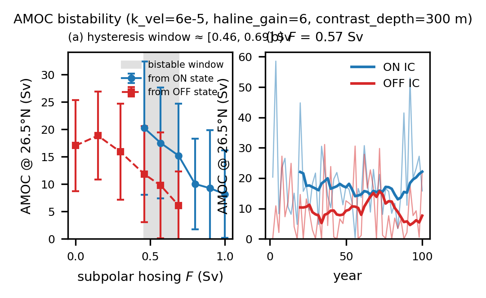

# AMOC tipping / bistability (P4)

Chronos-ESM reproduces a **genuine AMOC tipping point** — a saddle-node hysteresis window
in subpolar North-Atlantic freshwater hosing — using an interim density-driven thermohaline
closure with a tunable salt-advection feedback. This is the differentiable-model
demonstration of non-negotiable #3 (AMOC bifurcation).



*(a) the on-state and off-state branches vs hosing F — they stay separated across the
window; (b) at F=0.57 Sv the two initial conditions settle on different branches and do not
reconverge over 100 yr. Vector source: [`amoc_bistability.pdf`](figures/amoc_bistability.pdf).)*

## Result

Calibrated configuration: **`haline_gain = 6`, `thc_k_vel = 6e-5`, `thc_contrast_depth_m = 300`** (cd = 300 m).

| Hosing F (Sv) | ON-branch AMOC | OFF-branch AMOC | separation (z) |
|---|---|---|---|
| ≤ 0.30 | — | off-IC **recovers** to ON | below F_lower |
| 0.46 | ~20 Sv | ~12 Sv | 2.6 |
| 0.57 | ~18 Sv | ~10 Sv | 3.1 |
| 0.69 | ~15 Sv | ~6 Sv | 4.4 |
| ≥ 0.80 | on-IC **collapses** to ~9 Sv | — | above F_upper |

**Hysteresis window ≈ [0.38, 0.75] Sv, centered ~0.6 Sv** — the observed-realistic collapse
scale. The branches are statistically distinct (autocorrelation-corrected `z = 2.6–4.4`) and
the off-branch does not recover over 100 yr; this is established by an **initial-condition
(on-state vs off-state) bistability test at fixed forcing**, which is immune to the
rate-dependence that makes a finite-hold quasi-static sweep ambiguous.

## Caveats

- **Noisy branches.** The AMOC oscillates ±~10 Sv (a relaxation-oscillation intrinsic to the
  strong feedback). It is genuine bistability, not a clean low-variance loop. A *clean*
  bifurcation requires the prognostic-momentum ocean core (see
  [prognostic_ocean_core.md](prognostic_ocean_core.md)).
- **Interim closure.** The overturning is a Stommel/box-model parameterization
  (`chronos_esm/ocean/overturning.py`), not prognostic momentum. It *works around* the
  `d(AMOC)/d(density) ≈ 0` limitation of the diagnostic-velocity ocean; it does not solve it.
- Always compare **multi-decadal means**, not annual snapshots (the AMOC@26.5°N diagnostic is
  itself ±10–15 Sv noisy).

## How it works

`chronos_esm/ocean/overturning.py` adds a depth-integral-zero Atlantic overturning velocity
whose strength scales with the subpolar−subtropical upper-ocean density contrast:

    contrast = drho + (haline_gain − 1)·BETA_S·dS
    v_thc    = k_vel · softplus(contrast / drho_scale) · G(z) · atlantic_mask

- `haline_gain > 1` amplifies the subpolar **salinity** contrast's grip → raises the
  salt-advection feedback loop gain above 1 → bistability.
- `thc_contrast_depth_m` reads the contrast over the upper convection layer (~300 m), where a
  surface freshwater hosing actually controls deep-water formation (a 0–1100 m mean dilutes
  the surface anomaly ~22× and barely equilibrates in a decade).
- `thc_k_vel` sets the on-state strength; a realistic ~15 Sv on-state (smaller freshwater
  transport) tips at a lower F than an over-strong 28 Sv one.
- `subpolar_hosing_salt_tendency` injects the hosing freshwater into the 45–65°N Atlantic
  surface salt budget.

## Reproduce

```bash
# Quasi-static hysteresis sweep (auto-resumes; 12 h wall), self-contained from WOA:
sbatch --requeue experiments/run_amoc_hosing_slurm.sh \
    --spinup-years 20 --fmax 0.8 --nsteps 8 --hold-years 15 --avg-years 4 \
    --haline-gain 6 --k-vel 6e-5 --contrast-depth 300 --outdir /p/tmp/$USER/amoc_hose

# Rigorous fixed-F bistability test (run once per branch IC, from sweep checkpoints):
sbatch --requeue experiments/run_amoc_bistability_slurm.sh \
    --ckpt <on_state_base>  --hosing-sv 0.57 --haline-gain 6 --k-vel 6e-5 \
    --contrast-depth 300 --years 100 --outdir /p/tmp/$USER/amoc_bist/F0.57_on
# ... and from an off-state checkpoint -> compare the equilibrated last-40-yr means.

# Differentiable calibration (find the gain for a target F_crit in milliseconds):
python experiments/calibrate_amoc_fold.py --target 0.6 --kvel-rel 0.6 \
    [--anchors <hysteresis.npz>:<kvel_rel>:<gain> ...]

# Figure:
python experiments/plot_amoc_bistability.py --root /p/tmp/$USER/amoc_bist \
    --out docs/figures/amoc_bistability.pdf
```

## Differentiable calibration

Because a tipping threshold is a bifurcation (not a smooth output of one forward run), it
cannot be tuned by backprop through the hosing sweep — the sensitivity diverges *at* the
fold. `experiments/calibrate_amoc_fold.py` instead reduces the closure to a Stommel box and
uses **AD fold-continuation** (the envelope theorem makes the gradient through the fold
exact) to Newton-invert `(haline_gain, k_vel)` for a target `F_crit`. The GPU hosing runs
become calibration data for the box rather than a brute-force grid. The gradient ranking it
yields — `dF_crit/dk_vel ≈ +0.72` ≫ `dF_crit/dhaline_gain ≈ −0.086` Sv/unit — shows the
on-state strength is the dominant lever.
