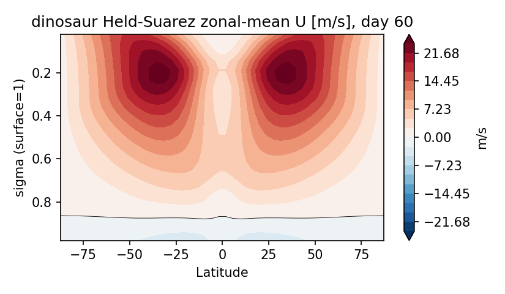
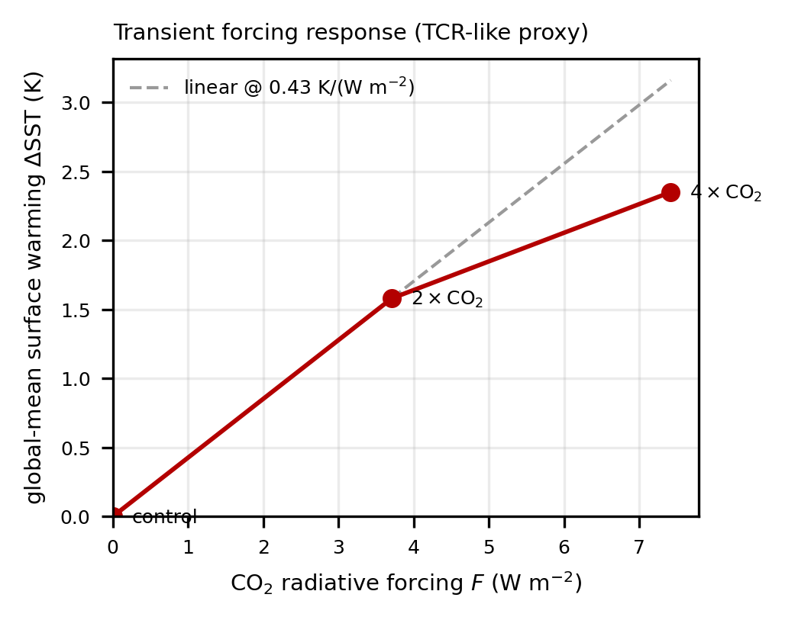
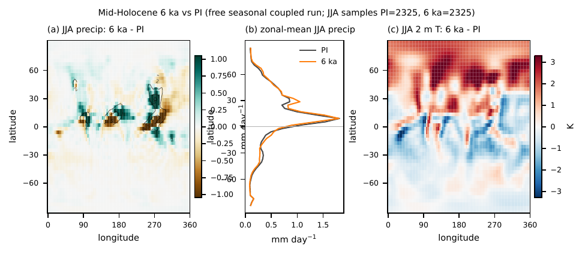

# Chronos-ESM — Showcase Gallery

A curated tour of what the model produces, organised by the four working-ESM
milestones of the [v0.1.0 research preview](release_notes_v0.1.0.md). Every result
here is reproducible from the scripts noted under each figure, and each comes with its
honest limitations — see the [README Project Status](../README.md#project-status-jun-2026)
and [Validation dashboards](../README.md#validation-dashboards) for the full picture.

> ⚠️ This is a **research preview** at coarse (T31, ~3.75°) resolution. The figures show
> real, validated behaviour *and* documented biases. Read the captions.

---

## 1 · Atmosphere — multi-level dynamics (`dinosaur` dycore)

Chronos-ESM's multi-level atmosphere is Google's differentiable **`dinosaur`** spectral
primitive-equation core (the dycore behind NeuralGCM). Unlike the single-level fallback,
it performs **genuine baroclinic instability** — growing transient synoptic eddies and a
twin upper-tropospheric jet.

### Baroclinic eddies from rest (animation)

Lower-tropospheric **relative vorticity** on a Held–Suarez aquaplanet, one frame per model
day from an isothermal rest state: smooth zonal flow → growing waves → fully turbulent
synoptic weather. This is the dynamics the single-level atmosphere *cannot* produce.
*Honest scope: the **dry** dycore on an idealized aquaplanet (no continents, Held–Suarez
forcing) — the dynamical proof, not the coupled Earth run.*
Reproduce: `python experiments/make_showcase_animation.py` (mp4 alongside the gif).

### Baroclinic jet (zonal-mean cross-section)

The same run, scored: a ~20–30 m/s upper-tropospheric mid-latitude westerly jet with
surface trade easterlies — the textbook Held–Suarez (1994) result, earned dynamically
from rest. Reproduce: `python experiments/dino_held_suarez.py`.

### Coupled circulation (SST-forced)

SST-coupled run on WOA SST (time-mean of a 120-day spin-up): an eddy-driven baroclinic
jet (left), surface winds with synoptic eddy structure (centre), and an equatorial ITCZ
(right). It **wins the hydrology** over the single level (precip pattern corr 0.16 → 0.34,
real ITCZ); surface wind/pressure skill is still limited by the weak T31 SST gradient.
Reproduce: `python experiments/dino_circulation_figure.py`.

---

## 2 · Ocean — AMOC tipping point

A tunable salt-advection feedback on the density-driven thermohaline closure produces a
**verified saddle-node hysteresis** in the Atlantic overturning.

Hysteresis window ≈ **[0.38, 0.75] Sv** of subpolar freshwater hosing (centred ~0.6 Sv):
on-state and off-state branches stay **8–9 Sv apart after 100 yr** (statistically
significant). `d(AMOC)/d(subpolar salinity)` is nonzero, sign-correct, and differentiable.
See [AMOC tipping](amoc_tipping.md). Reproduce: `experiments/run_amoc_bistability.py`.

The Atlantic overturning streamfunction. *Honest limitation: the AMOC uses a thermohaline
**closure**; a fully prognostic-momentum ocean core hits a T31 geostrophic-resolution
barrier (overturning O(300–550 Sv), ~20–40× too large) and stays research-in-progress —
see [prognostic ocean core](prognostic_ocean_core.md).*

---

## 3 · Forcing response (CO₂)

In free-ocean (frozen q-flux) mode the coupled model **warms under CO₂**: an abrupt-2×CO₂
experiment gives **ΔSST ≈ +1.58 K** (0.43 K/(W m⁻²)). *Honest scope: a transient
surface-forcing **proxy**, not equilibrium climate sensitivity — no atmospheric
radiative-feedback amplification.* Reproduce: `experiments/run_dino_co2.py`.

---

## 4 · Paleoclimate — mid-Holocene (6 ka)

The model has a **real seasonal cycle** (orbital insolation, `chronos_esm/orbital.py`) and
responds to **6 ka orbital boundary conditions** with the correct mid-Holocene fingerprint.
A PMIP-style 6 ka-vs-PI run (orbit-only difference) gives **NH summer warming +1.1 K
(20–60 °N), +1.9 K Arctic** and **monsoon intensification** (S/SE Asia +31 %, N. America
+20 % JJA precip; ITCZ +0.2° N), with global-annual ≈ 0 as orbital forcing requires.
Differentiable: `d(insolation)/d(obliquity)`. *Honest limitation: the "Green Sahara" is not
captured (the T31 African monsoon is ~absent to begin with).* See
[mid-Holocene experiment](paleo_midholocene.md). Reproduce: `experiments/run_paleo_midholocene.py`.

---

## 5 · Validation against observations

A built-in framework (`chronos_esm/validation/`) scores output against **WOA18** (ocean
T/S) and **ERA5** (near-surface atmosphere). The 100-yr flux-corrected coupled control
(`dinosaur` ↔ ocean), years 82–100:

| field | units | bias | RMSE | corr | std ratio |
|---|---|---:|---:|---:|---:|
| sst | °C | 0.44 | 0.89 | 1.00 | 1.00 |
| t2m | K | 3.52 | 8.63 | 0.88 | 0.57 |
| precip | mm/day | -2.32 | 3.07 | 0.37 | 0.45 |
| u_sfc | m/s | -0.99 | 4.05 | 0.10 | 0.59 |
| mslp | hPa | -11.70 | 15.87 | -0.35 | 0.60 |

The emergent skill is the **revived ITCZ** (precip corr 0.08 → 0.37) and **land air
temperature** (t2m corr 0.50 → 0.88). SST corr is 1.00 *by construction* (restored to WOA).
Sea-level pressure stays weakest (corr −0.35): the T31 single-gradient atmosphere has
little synoptic skill. Full bias maps and zonal means are in the
[README validation dashboards](../README.md#validation-dashboards).

**Example bias maps**

---

## Reproducing the figures

| Figure | Script |
|---|---|
| Baroclinic-eddy animation | `experiments/make_showcase_animation.py` |
| Held–Suarez jet | `experiments/dino_held_suarez.py` |
| Coupled circulation | `experiments/dino_circulation_figure.py` |
| AMOC bistability | `experiments/run_amoc_bistability.py` |
| CO₂ forcing response | `experiments/run_dino_co2.py` |
| Mid-Holocene paleo | `experiments/run_paleo_midholocene.py` + `experiments/plot_paleo_midholocene.py` |
| Validation dashboard | `experiments/make_readme_figures.py` |
